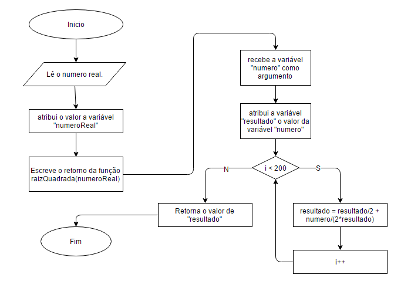

# BCCPOLYA

### Problema
Desenvolver uma função em C que calcule uma aproximação da raiz quadrada de um numero real

### Solução em português estruturado:
```portugol
var numeroReal : real;
funcao main():real;
início
	LEIA numeroReal
	ESCREVA raizq(numeroReal)
fimfuncao

funcao raizq(numeroReal:real): real;
início
	var resultado:real
	resultado <- numeroReal
	para i de 0 ate 200 passo 1 faca
		resultado <- resultado/2 + numeroReal/(2*resultado);
	fimpara
	retorna resultado
fimfuncao
```

### Solução em fluxograma:


### Porque Polya no nome do repositorio ?
Porque o "Polya" vem de [George Pólya](https://pt.wikipedia.org/wiki/George_P%C3%B3lya) que foi um grande matematico que comtribuiu muito para a [Heurística](https://pt.wikipedia.org/wiki/Heur%C3%ADstica) que consiste em um método que tem como objetivo encontrar soluções para um problema.
### Uso 